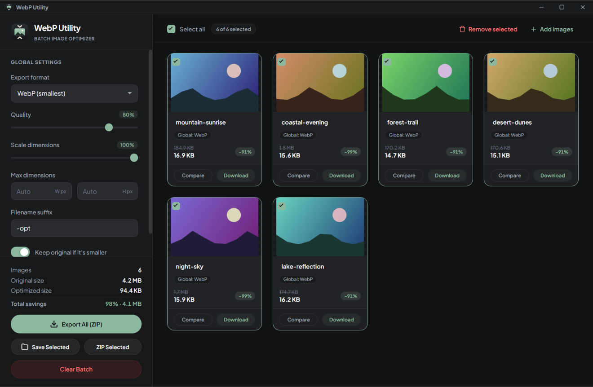
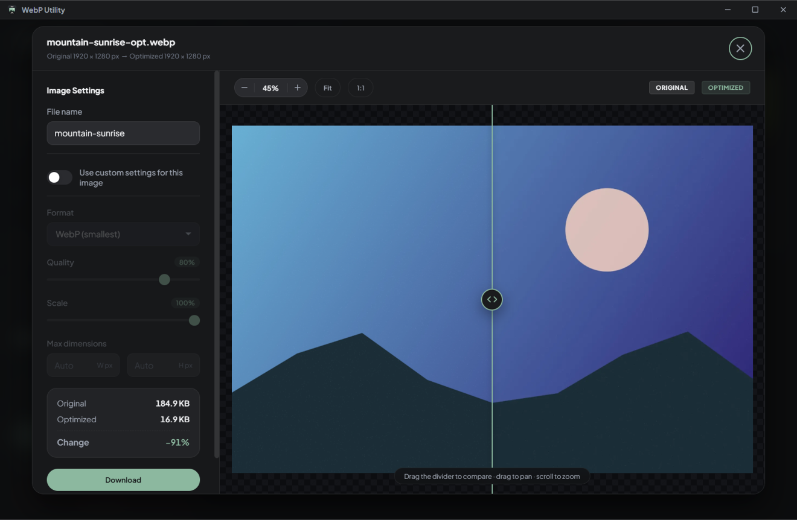

<p align="center">
  
</p>

<h1 align="center">WebP Utility</h1>

<p align="center">
  A local-first desktop app for batch converting and compressing images to <b>WebP</b>, <b>JPEG</b> and <b>PNG</b>.<br>
  Your images never leave your computer.
</p>

<p align="center">
  <a href="https://github.com/Sanket-Gawande/webp-utility/releases/latest"><b>Download for Windows</b></a>
</p>



## Features

- **Batch optimization** – drop images or whole folders, paste with `Ctrl+V`, or browse. Images are processed in parallel in the background.
- **WebP, JPEG and PNG output** with quality, scale and max-dimension controls. WebP at 100% quality is lossless.
- **Per-image overrides** – give any image its own format, quality and size while the rest follow the global settings.
- **Before/after inspector** – a split-view comparison with synchronized zoom and pan. Zoom past 200% to inspect individual pixels.
- **Honest numbers** – every card shows the real size change, including when a file gets *bigger*. With *Keep original if it's smaller*, files that would grow in the same format keep their original bytes.
- **Safe exports** – download a ZIP or save straight into a folder. Duplicate names are numbered automatically, invalid file-name characters are replaced, and existing files are never overwritten without asking.
- **Rename in place** – double-click a card title (or press `F2`) to rename an image; the extension and suffix are handled for you.
- **Private and offline** – no uploads, no analytics, no network requests. Re-encoding also strips EXIF metadata such as GPS location.



## Installation

Download `WebP-Utility-Setup-<version>.exe` from the [latest release](https://github.com/Sanket-Gawande/webp-utility/releases/latest) and run it. The installer lets you pick the install folder and creates Start Menu and Desktop shortcuts.

The installer is not code-signed, so Windows SmartScreen may show a warning. Choose **More info → Run anyway**.

## Keyboard shortcuts

| Shortcut | Action |
| --- | --- |
| `Ctrl+O` | Add images |
| `Ctrl+V` | Paste images from the clipboard |
| `Ctrl+A` | Select / deselect all images |
| `Delete` | Remove selected images |
| `F2` or `Enter` on a card title | Rename |
| `Esc` | Close the inspector or dialog |
| `+` / `-` | Zoom in / out (inspector) |
| `0` / `1` | Fit to screen / actual size (inspector) |
| `←` / `→` on the divider | Move the comparison divider |

## Supported formats

| Input | Output |
| --- | --- |
| JPEG, PNG, WebP, AVIF, GIF, SVG, BMP, ICO | WebP, JPEG, PNG |

Good to know:

- Animated GIF and WebP files are exported as a still image of their first frame.
- Transparent areas become white when exporting to JPEG, which has no transparency.
- Colors are converted to sRGB, and metadata (EXIF, color profiles) is not carried over.
- TIFF, HEIC and camera RAW files can't be decoded and are skipped.
- Very large images are scaled down to fit the maximum canvas size of 16,384 px per side.

## Development

Requires [Node.js](https://nodejs.org/) 20 or newer.

```bash
npm install
npm start          # run the app
npm test           # unit tests for the pure helpers
```

The renderer is plain HTML, CSS and JavaScript with no build step. You can also serve the project folder with any static server and open `src/renderer/index.html` in Chrome or Edge; folder saving then uses the File System Access API.

### Building the installer

```bash
npm run build:win
```

The installer is written to `dist/`. On Windows you can also double-click **`build.bat`**, which installs dependencies, builds the installer and copies it to your Desktop.

### Publishing a release

Update the version in `package.json`, add a section to `CHANGELOG.md`, then push a tag:

```bash
git tag v1.1.0
git push origin v1.1.0
```

The [release workflow](.github/workflows/release.yml) builds the installer on GitHub Actions and attaches it to a new GitHub release, using the matching `CHANGELOG.md` section as release notes.

### App icon

`assets/icon.svg` is the single source for every icon. After editing it, regenerate the raster versions (`build/icon.ico`, `build/icon.png`, `assets/icon.png`):

```bash
npm run icons
```

### Project structure

```
assets/            App icon (SVG source + runtime PNG)
build/             Packaging icons used by electron-builder
scripts/           Icon generator
src/main.js        Electron main process: window, native dialogs, guarded file writes
src/preload.js     Minimal bridge exposed to the page as window.desktop
src/renderer/      The UI
  index.html
  styles.css
  js/helpers.js    Pure helpers: file names, sizing, settings validation (unit tested)
  js/compressor.js Canvas-based decode / resize / encode
  js/viewer.js     Before/after comparison viewer
  js/app.js        Batch state, queue, UI and exports
test/              Node test runner specs
```

## Tech stack

- [Electron](https://www.electronjs.org/) with a sandboxed, context-isolated renderer and a strict Content Security Policy
- Browser-native image decoding and Canvas encoding
- [JSZip](https://stuk.github.io/jszip/) for ZIP export
- [Plus Jakarta Sans](https://fontsource.org/fonts/plus-jakarta-sans), bundled locally
- [electron-builder](https://www.electron.build/) for the NSIS installer

## License

[MIT](LICENSE) © Sanket Gawande
